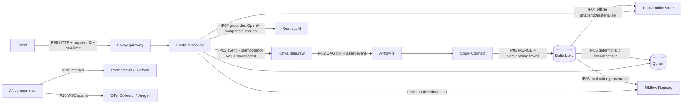

# Lab 28 architecture and ownership

## System context

The five presentation layers are: client/edge, L1 compute and serving, L2 data,
L3 ML, and L4 operations. The critical state owners are Kafka offsets, Delta
transaction logs, Qdrant points, Feast online rows, and MLflow model versions.

## Integration ownership

| Owner | Integration points | Operational responsibility |
|---|---|---|
| Ingestion & Orchestration | IP01-IP02 | Schema, Kafka key/header, retry, commit-after-MERGE, DLQ and DAG run |
| Data & ML | IP03-IP04-IP06 | Delta version, Feast materialization, release provenance and rollback |
| Serving & Retrieval | IP05-IP07 | Stable vector identity, grounding, latency budget and vLLM identity |
| Platform & Observability | IP08-IP10 | Gateway policy, readiness, metrics, alerts, traces and GitOps |
| Presenter / Incident Commander | IP01-IP10 | Evidence index, incident timeline, no-data-loss proof and Q&A |

This is an individual submission by Ong Xuan Son, so one contributor owns and
must be able to explain every boundary. The role split is retained to make fault
triage and production ownership explicit.

## Contract and failure rules

- Kafka delivery is at-least-once. The API propagates a W3C trace context and an
  idempotency key; the consumer commits only after the Delta MERGE is durable.
- Delta collapses replay by `idempotency_key`; `(occurred_at, event_id)` makes
  the newest winner deterministic even when delivery order changes.
- Qdrant point UUIDs derive from `doc_id`, so re-indexing overwrites the same
  logical point.
- Feast is optional on the serving path: failure is visible as `degraded`.
  Kafka, Qdrant, MLflow, and a required real-vLLM endpoint fail readiness closed.
- MLflow's `champion` alias selects a complete release bundle. Promotion and
  rollback change desired model state without changing application code.
- A successful demo trace carries one trace ID across synchronous and
  asynchronous boundaries; span IDs are expected to differ.

## Kubernetes production controls

The base manifests specify two API replicas, startup/liveness/readiness probes,
resource requests and limits, HPA, PodDisruptionBudget, a restricted service
account, non-root execution, read-only root filesystem, dropped Linux
capabilities, NetworkPolicy, and Gateway API routing. Argo CD uses automated
pruning and self-heal with an immutable desired revision.

